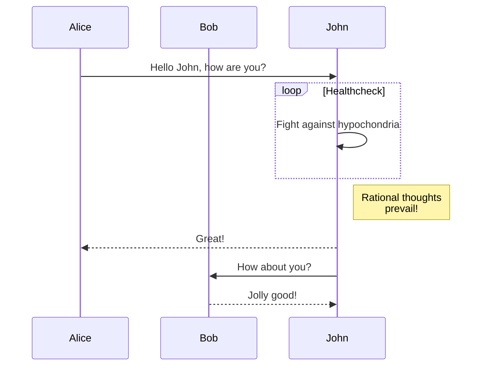
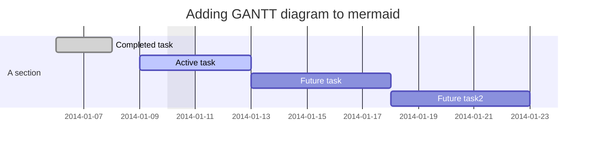
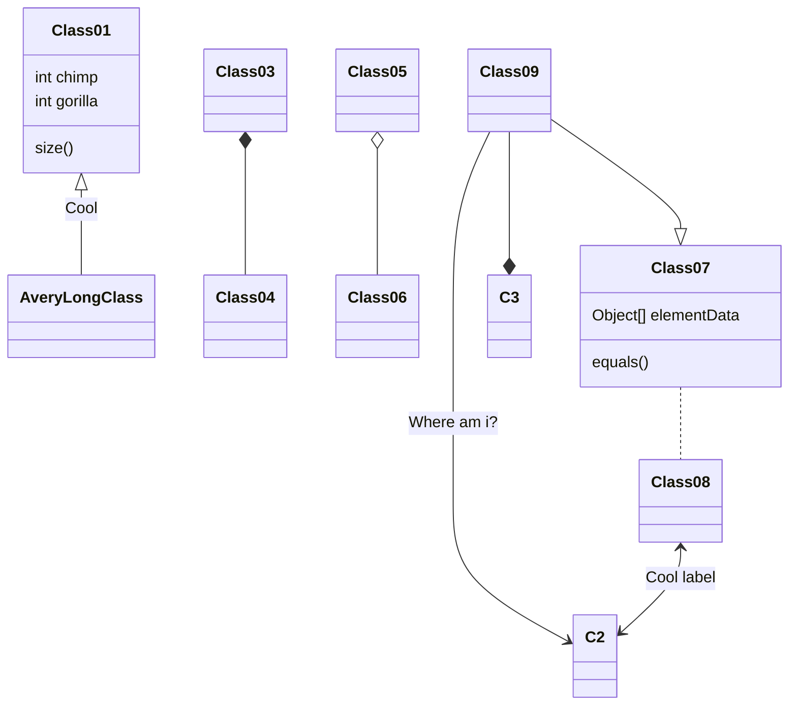
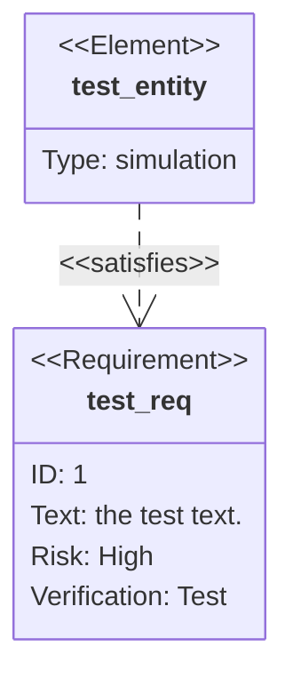
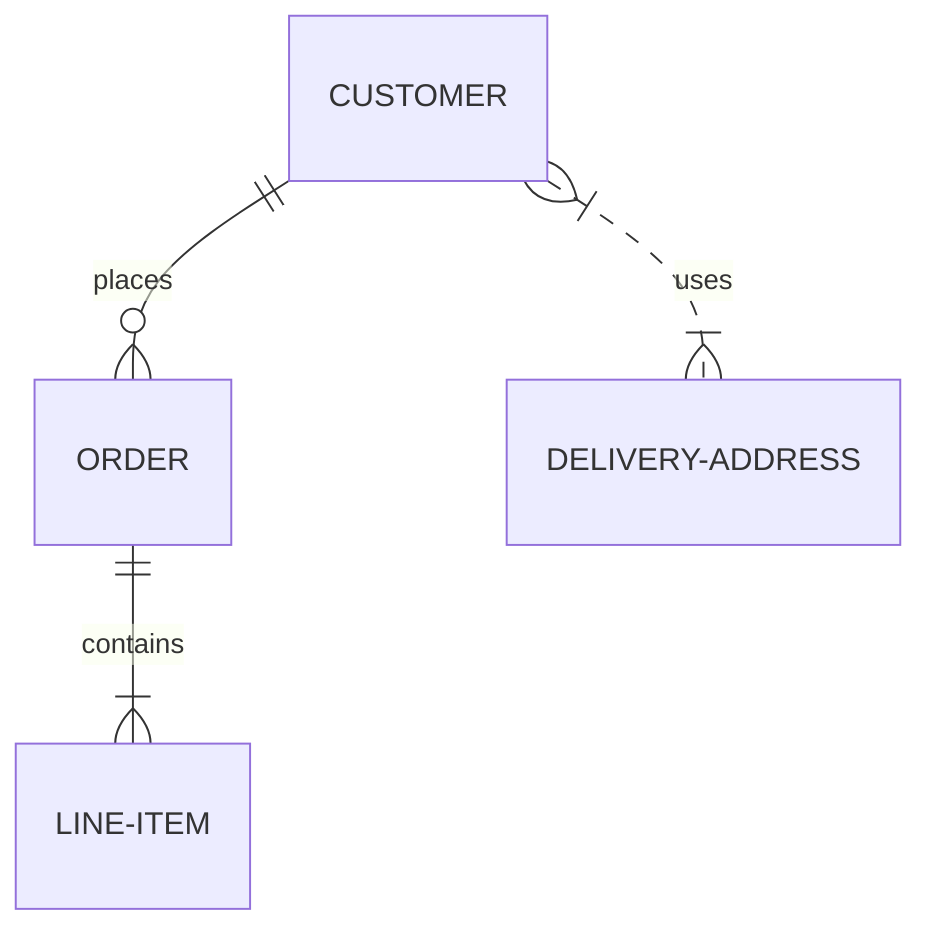
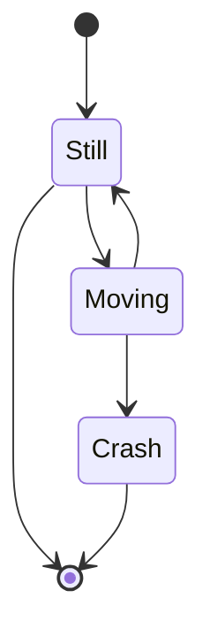
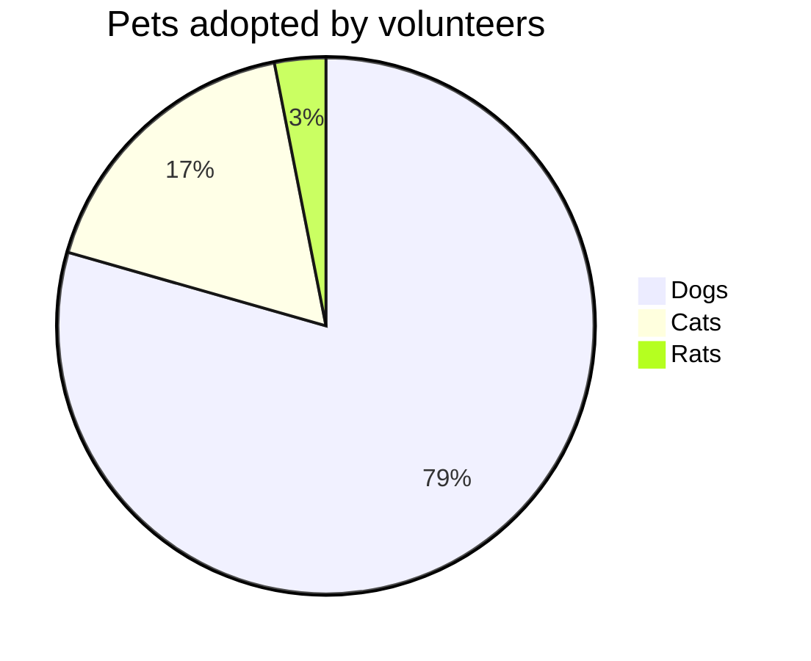
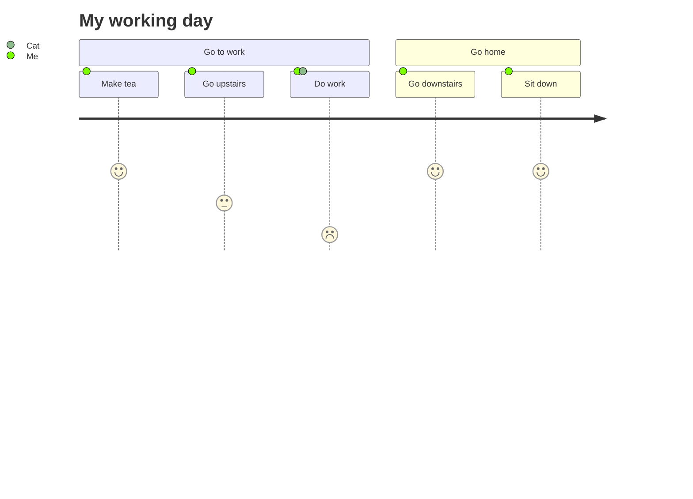

# Mermaid (diagrammes pour markdown)
- [Voir la doc Mermaid](https://mermaid-js.github.io/mermaid/#/) pour plus de détails
- Preview:
    - Par défaut Mermaid n'est pas rendu en preview sur vscode, on peut ajouter un plugin (ex: ``Markdown Preview Mermaid Support`` par Matt Bierner). 
    - Sur gitHub la preview n'est pas encore supporté mais sur GitLab oui
    - Il est aussi possible de l'utiliser dans un fichier HTML (voir la doc) notamment via un cdn
- Pour l'utiliser dans notre ``.md`` il suffit d'ajouter un bloc de code ``mermaid``:

### Exemples de diagrammes
#### [Flowchart](https://mermaid-js.github.io/mermaid/#/flowchart)

#### [Sequence diagram](https://mermaid-js.github.io/mermaid/#/sequenceDiagram)

#### [Gantt diagram](https://mermaid-js.github.io/mermaid/#/gantt)

#### [Class diagram](https://mermaid-js.github.io/mermaid/#/classDiagram)

#### [Gitgraph diagram (Experimental)](https://mermaid-js.github.io/mermaid/#/README)

#### [Requirement Diagrams](https://mermaid-js.github.io/mermaid/#/requirementDiagram)

#### [Entity Relationship Diagram (Experimental)](https://mermaid-js.github.io/mermaid/#/entityRelationshipDiagram)

#### [State Diagram](https://mermaid-js.github.io/mermaid/#/stateDiagram)

#### [Pie Chart](https://mermaid-js.github.io/mermaid/#/pie)

#### [User Journey Diagram](https://mermaid-js.github.io/mermaid/#/user-journey)

