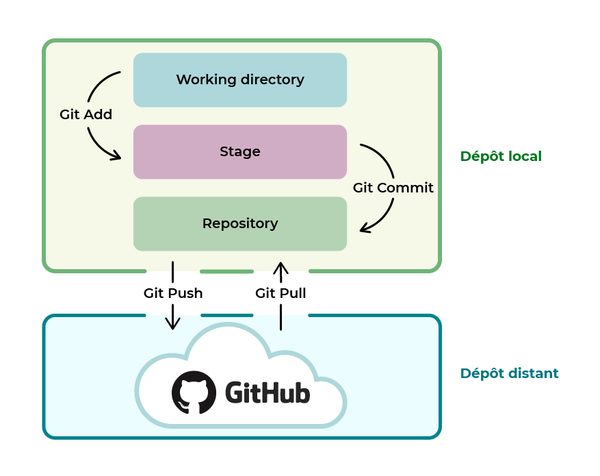

# Bases de Git

## Introduction
Un **gestionnaire de versions** , permet aux dev de garder un historique  de chaque étape/version de leur travail, on parle de **contrôle de versions** (versonning en anglais)

- Le gestionnaire de versions garde en mémoire:
	- chaque modif de fichier
	- pourquoi elle a lieu
	- par qui elle est réalisée

- Cet outil a 3 principales fonctionnalités:
	- Revenir à une version précédente
	- Suivre l'évolution du code étape par étape
	- Travailler à plusieurs sans risque de supression du code des autres.

- Il existe deux types de gestion de version:
	- **Modèle centralisé**: centralisation du code source sur un serveur distant local, on se connecte à ce serveur pour travailler sur le code

	- **Modèle distribué (ou décentralisé)**: chaque utilisateur télécharge et héberge un clone du projet sur sa machine

- Différence **Git** et **GitHub**:
	- **Git**: gestionnaire de versions décentralisé: utilisé pour créer le dépot (repository) local et gérer nos versions de fichiers (solo)

	- **GitHub**: service en ligne : utilisé pour héberger le dépot distant. (multi)


### Différentes plateformes de gestionnaires de versions:
- GitHub le plus connu et qui sert même de portfolio pour le recrutement

- Gitlab, version alternative de gitHub non détenue par microsoft

- Bitbucket, version de Atlassian un éditeur de logiciels australien

### Vocabulaire:
- **Repository**, ou **Dépôt** : copie de l'intégralité des fichiers d'un projet et de leur version sur le seveur central

- **Pointeur** : un objet qui contient l'adresse d'une donnée stockée quelquepart, par exemple quand on commit git créé un objet qui contient le nom et prénom de l'auteur , le message renseigné et un pointeur vers l'instantané du contenu indexé, quand on créé une branche cela créé seulement un pointeur

## Fonctionnement de git

### Les dépôts:
- Le **dépôt local**, constitué de:
	- **Working directory** (répertoire de travail local)
	- **Stage** ou **Index** étape de validation entre les deux zones
	- **Repository** (zone de stockage des versions)

- Le **dépot distant** (ex: github)



### Etapes de base:
- Ajouter, supprimer ou modifier un élément
- ``add``: **Indexer/Stager** cet élément
- ``commit -m``: **Archiver** le projet en le commentant
- ``push``: **Pousser** les commits sur le dépôt distant

## Fonctionnalités
- Sous GitHub: Réalisation d'[actions](git_actions.md) pour **l'intégration continue**

- Dans un répertoire ``.git`` on a la possibilité de créer un fichier ``.gitignore`` pour:
	- ajouter les noms des fichiers que l'on veut exclure de l'indexation
	- mentionner des schémas de nom (tous les fichiers qui y correspondent seront ignorés)
	- on peut aussi exclure le contenu entier d'un répertoire en écrivant son chemin suivi d'un slash
	- Il faut généralement exclure de l'indexation:
		- tous les fichiers sensibles (fichiers de config)
		- les bibliothèques externes (qui peuvent être téléchargés à part du projet sans problème, où généralement installées via ``composer`` ou ``npm``)
	- Sous wordpress il faut donc exclure ``wp-config.php``
	- Sous Laravel if faut exclure ``.env``, le dossier ``vendor`` et le dossier ``node_modules`` s'il est présent

## Commandes
### Paramétrer Git globalement sur une machine
``--global`` : pas besoin d'y refaire à chaque fois, on peut retaper une commande sans global pour modifier un élément sur un projet:
- Lister les éléments de la config actuelle pour cette machine:
	- ``git config --list``

- Pour le nom et le mail:
	- ``git config``   
	- ``git config --global user.name "John Doe"``    
	- ``git config --global user.email johndoe@example.com``

- Pour les couleurs et la lisibilité des branches:
	- ``git config --global color.diff auto``  
	- ``git config --global color.status auto``  
	- ``git config --global color.branch auto`` 

- Pour configurer l'éditeur et l'outil de merge (utilisé pour fusionner des parties distinctes d'un projet, fonctionne avec n'importe quel éditeur):
	- ``git config --global core.editor notepad++``
	- ``git config --global merge.tool vimdiff``

### Initialiser un répertoire
- ``cd documents/project`` : se déplacer dans le projet voulu (créé au préalable)

- ``git init``: initialise le dossier comme étant un dépot

### Cloner
```
git clone https://github.com/UserName/projet.git
git branch -M main
git remote add origin https://wholeurl.git
git push -u origin main
```

### Effectuer des changements
- ``git add filename``: ajoute au stage

- ``git commit -m "Write commit comment"``: commit, -m pour commenter

- ``git commit -m --ammend "oups forgot this one"``: remplace le commit précédent

- ``git push distant-name branchName``: push

### Afficher les états des fichiers
- ``git status``: liste tous les nouveaux fichiers et les fichiers modifiés à commiter

- ``git diff``: affiche les modifications encore non indexées des fichiers

- ``git diff``: affiche la différence entre la version indexée et la dernière version

- ``git reset fileName``: Le fichier est retiré de la zone d'index et ne fait donc pas parti du prochain commit

- ``git ls-files --other --ignored --exclude-standard``: liste tous les fichiers exclus du suivi de version du projet

### Push sur un dépôt git existant
- ``-M`` est l'argument pour ``new Branch``, cela permet de changer le nom d'origine ``master`` par ``main``
```
git remote add origin git@github.com:GitUserName/project.git

git branch -M main

git push -u origin main
```

### Créer un repository entièrement en lignes de commandes
```
mkdir testproject
cd testproject
echo "# testproject" >> README.md
git init
git add README.md
git commit -m "first commit"
git branch -M main
git remote add origin git@github.com:gitUser/testproject.git
git push -u origin main
```

### Branches
- ``git branch``: lister les branches

- ``git branch -d branchName``: supprimer une branche

- ``git branch -D branchName``:  supprimer en forçant

- ``git branch branchName``:  créer une branche

- ``git checkout branchName``: basculer sur une autre branche (cela permet de déplacer HEAD un pointeur spécial qui par défaut pointe sur master (ou main))

- ``git checkout -b branchName``: créer une branche et basculer directement dessus

- ``git merge branchname``: fusionner la branche avec la branche dans laquelle on se trouve

### Renommer ou supprimer
- ``git rm fileName``: supprime le fichier du répertoire de travail et met à jour l'index/stage

- ``git rm --cached fileName``: supprime le fichier du système de suivi de version mais le préserve localement

- ``git mv oldname newname``: renomme le fichier

### Consulter l'historique
Si on a besoin de revenir à une ancienne version, on peut utiliser la **journalisation** (log file), chaque commit possède un identifiant *SHA (secure hash algorithm)* de longues chaines de caractères qui dans ce cas servent à identifier les commits

- ``git log``: historique des versions pour la branche actuelle

- ``git log --follow fileName``: historique des versions (dont les renommages) pour ce fichier

- ``git log --pretty=oneline``: chaque commit sur une ligne

- ``git log --since=2.weeks``: que les modifs depuis 2 semaines (différents modèles de date possibles, ex: ``--since=2021-10-10``)  

- ``git log --author=name``: que les commit d'un auteur particulier  

- ``git reflog``: permet de voir toutes les actions et commits effectués, c'est à dire qu'en plus des commits , il peut nous afficher les merges, changement de messages,...
	- Ainsi si on veut revenir à une action donné: ``git checkout e789e7c [code SHA]``
 
- ``git diff branchA branchB``: montre les différences de contenu entre les deux branches

- ``git show commitName``: montre les modifications de métadonnées et de contenu de ce commit

- ``git blame``: permet d'afficher pour chaque ligne modifié d'un doc commité: son ID, son auteur, l'horodatage, le numéro de ligne et le contenu de la ligne

- ``git cherry-pick`` : si on souhaite uniquement sélectionner certains commmit d'une branche pour les migrer vers main sans fusionner les deux branches, on utilise cherry-pick puis les SHA des commits voulus, il est génralemtn peu recommandé d el'utiliser car cela duplique des commits existants

### Corrections d'erreurs et annulations de commit
- ``git restore filename``: restaurer un fichier à son dernier état sauvegardé

- ``git reset commitName``: annule tous les commits après ce commit, en conservant les
modifications localement

- ``git reset --hard commitName``: supprime tout l'historique et les modifications effectuées après ce commit 

- ``git reset --mixed HEAD~``: permet de revenir en arrière juste après le dernier commit ou le commit spécifié mais sans supprimer les modifs en cours, si les fichiers sont indexés mais pas commités cela les désindex, HEAD est le pointeur qui référence notre position actuelle dans le répertoire de travail

- ``git reset --soft`` : permet de se placer sur un commit spécifique pour voir le code d'une ancienne version, ou créer une branche qui part d'un ancien commit, sans suppprimer le moindre fichier ou commit

- ``git revert HEAD^`` (au lieu de ``git reset``), cela sert à annuler les changements sur une branche publique,


### Résolutions de conflits
Si on merge deux fichiers et qu'une même ligne a été changée de plusieurs façons, cela peut créer des conflits, il faudra alors ouvrir le fichier et à l'endroit du conflit supprimer les éléments inutiles, puis redire à git de "add" et "commit"

### Remises
Elles permettent de mettre en attente des modifs non finies et d'y revenir après -->[Voir Git stash](git_stash.md)
- ``git stash``: enregistre temporairement les fichiers versionnés (mais non commit) qui ont été modifiés

- ``git stash pop``: applique une remise et la supprime immédiatement

- ``git stash list``: listes les remises

- ``git stash drop``: supprime la dernière remise

### Accéder à un dépôt distant et le copier en local:
- Initialiser le répertoire dans lequel on voudra ajouter le dépot distant avec: ``git init``
- sur le dépôt distant dans ``code`` copier l'url
- pointer vers le dépôt distant avec: ``git remote add TP https://github.com/UserName/testprojet.git``
- TP est un exemple de nom court que l'on donne au dépôt (c'est plus rapide)
- Puis on se place sur la branche locale main: ``git branch -M main``
- Enfin on duplique le dépôt en local: ``git pull TP main``

### Synchronisation entre les dépôts
- ``git fetch nom-distant`` : récupère les données du depot sous une autre branche

- ``git pull`` récupère les données d'une branche distante et les fusionne à notre branche locale

### Avancé
- ``git rebase`` : récupère les modifications validées sur une branche pour les intégrer à une autre, cela revient un peu au meme qu'un merge, mais l'historique est plus clair car les modifs apparaissent en série, ne jamais rebaser des commits déjà push sur un depot public

- ``git bissect`` = Utilise la [recherche dichotomique](../learning_general/algorithmic.md/#recherche-dichotomique) pour trouver quel *commit*, d'une liste de *commit* situés entre un "bon" et un "mauvais" *commit*, a introduit un bug

### GitFlow et Source Tree
+ source tree permet de gérer son git flow, on peut
    - facilement créer des features, on peut ensuite les merge dans nos branches
    - créer des hotfix, ce sont des features qui se mergent automatiquement sur toutes les branches en cours (on peut les nommer 1.0.1,...)

+ git flow:
    - cloner depuis un projet commun:
        - ``git flow init``
        - ``flow init -f`` = forcer
        - ``flow init -d``

### Clés SSH
Si notre accès à distance ne fonctionne pas, cela peut être du à un problème d'authentification du réseau, on peut le régler en créant une paire de clés SSH:
- Secure Shell: il s'agit d'un duo composé d'une clé privé et d'une clé publique, comme pour un [chiffrement asymétrique](../learning_general/asymmetric-cryptography.md), sauf qu'on utilise le chiffrement assymétrique que pour envoyer une clé symétrique chiffré entre le serveur et le client, puis seul cette nouvelle clé symétrique est utilisée pour communiquer, les deux l'ayant reçu de manière asymétrique, elle est safe)

- Pour créer un duo de clés ssh:
	- ``ssh-keygen -t rsa -b 4096 -C "exemple@email.com"``
	- On peut ensuite indiquer un nom de fichier, valider avec entrée, puis entrer un mot de passe et sa confirmation
	- puis on va dans ``users/username`` et on affiche les dossiers masqués, il y'aura un dossier ssh, on y trouve la clé publique (id_rsa.pub) et la privée (id_rsa.txt)
	- on copie la clé publique (en l'ouvrant dans un éditeur puis en copiant), ensuite on va sur github, sur notre avatar, dans ``settings``
	- puis sur ``ssh/gpg``, on clique sur ``new ssh key``, on choisit le titre et on colle la clé publique dans ``key``, on confirme le mot de passe et cela ajoute la nouvelle clé ssh au compte github