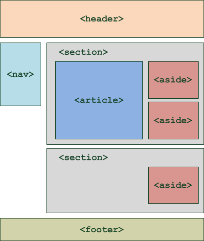

# Le HTML (Hyper Text Markup Language)

## Bases et vocabulaire
+ créé par Tim Berner Lee en 1991
+ C'est un langage de description, on distingue en effet:
	- langage de programmation: javascript, python,...
	- langage serveur: php, ruby, django(python), javaEE
	- langage de description: html, css

+ Il permet de gérer et organiser le contenu d'une page web
+ **Navigateur**: Lit le CSS et l'HTML, tous les navigateurs n'affichent pas tout de la même façon

+ **balise en pairs** : ``<balise ouvrante>`` texte ``</balise fermante>``
+ **balise orpheline** : ``<balise />``, le ``/`` n'est pas nécessaire mais recommandé pour éviter de confondre avec une balise ouvrante
+ **attributs** : ``<balise attribut="valeur">`` sert a donner des infos en plus -> exemple ``<image nom="photo.jpg"/>``
+ Pour les balises par pairs l'attribut ne se met que dans la balise ouvrante

+ **Indentation**: le fait d'utiliser ``tab`` pour decaler des lignes de code

## Types de balises
### **block**: 
- une balise qui délimite un bloc (figure, paragraphe,...)
- occupe par défaut tout l'espace en largeur
- la balise générique ``<div></div>``

### **inline**: 
- une balise qui ne fait qu'encadrer une ligne ou une partie de texte (mark, em, strong,...)
- n'occupe en largeur et en hauteur que le tour du contenu qu'elle encadre
- la balise générique <span></span>

### **inline-block**
- Emprunte ses caractéristiques aux ``blocks`` et aux ``inline``
- Utilisé par défaut par certaines balises de contenu embarqué comme ``<audio>``, ``<canvas>``, ``<embed>``, ...
 exemple celles des tableau (type ) ou des puces (type )

### **table-cell**
- Utilisé par les cellules de tableaux

### **list-item**
- Utilisé par les éléments de listes

## Structure HTML de base

```html
<!--Type de document, indique au navigateur qu'il s'agit d'HTML-->
<!DOCTYPE html>
<html lang="fr"> <!--On ajoute généralement l'attribut de langue de la page -->
	<!--L'en-tête donne les métadonnées de la page (ce qui n'est pas affiché), et permet de lier les fichiers de style à charger-->
	<head> 
		<meta charset="UTF-8"> <!--indique l'encodage du fichier (c'est a dire la facon dont il est enregistré-->
		<link rel="stylesheet" type="text/css" href="style.css">
		<title>Titre</title>
	</head>
	<!--Le corps = Le contenu de la page-->
	<body>
	<header><!-- Header (en tête), contient généralement le logo, la bannière, le slogan du site-->
		<h1>Titre Principal (Attention à la hiérarchie des titres)</h1>		
	</header>
	<nav><!--Menu de navigation: regroupe tous les liens principaux de navigation du site-->
		<ul>
			<li><a href="#">Item de menu</a></li>
			<li><a href="#">Item de menu 2</a></li>
		</ul>		
	</nav>
	<section><!--regroupe des contenus en fonction de leur thème-->
		<aside>
			<!--Contient des infos complémentaires (exemple: bloc d'infos de wikipédia)-->
		</aside>
		<article>
			<!--Sert à englober une portion généralement autonome de la page-->
		</article>
	</section>
	<footer>
		<!--Le pied de page peut contenir des infos comme les liens de contact, le nom de l'auteur, les mentions légales,...-->
		<a href="#">Contact</a>
		<a href="#">Mentions légales</a>
	</footer>
	</body>
</html>
```

### Différentes technologies liées à HTML:
#### Canvas : 
- permet de dessiner au sein de la page web
- à l'intérieur de la balise HTML ``<canvas>`` 
- Permet dessiner des formes (triangles, cercles…)
- Permet ajouter des images, les manipuler, appliquer des filtres graphiques… 
- Peut permettre de réaliser de véritables jeux et des applications graphiques directement dans des pages web

#### SVG : 
- Permet de créer des dessins vectoriels au sein des pages web
- À la différence des canvas, ces dessins peuvent être agrandis à l'infini (c'est le principe du vectoriel) 
- Le logiciel *Inkscape* sert notamment à dessiner des SVG

#### Drag & Drop : 
- permet de faire ``glisser-déposer`` des objets dans la page web, de la même façon qu'on peut faire glisser-déposer des fichiers sur son bureau
- Gmail l'utilise pour permettre d'ajouter facilement des pièces jointes à un e-mail.

#### File API : 
- permet d'accéder aux fichiers stockés sur la machine du visiteur (avec son autorisation)
- S'utilise notamment en combinaison avec le Drag & Drop.

#### Géolocalisation : 
- pour localiser le visiteur et lui proposer des services liés au lieu où il se trouve (ex. : les horaires des salles de cinéma proches)
- La localisation n'est pas toujours très précise, mais cela peut permettre de repérer un visiteur à quelques kilomètres près (avec son accord)

#### Web Storage : 
- permet de stocker un grand nombre d'informations sur la machine du visiteur
- C'est une alternative, plus puissante, aux traditionnels cookies
- Les informations sont hiérarchisées, comme dans une base de données.

#### AppCache : 
- permet de demander au navigateur de mettre en cache certains fichiers, qu'il ne cherchera alors plus à télécharger systématiquement
- Très utile pour créer des applications web qui peuvent fonctionner même en mode *hors ligne*

#### Web Sockets : 
- permet des échanges plus rapides, en temps réel, entre le navigateur du visiteur et le serveur qui gère le site web (c'est une sorte d'AJAX amélioré)
- À l'avenir pourrait permettre aux applications web de devenir aussi réactives que les vrais programmes

#### WebGL : 
- permet d'introduire de la 3D dans les pages web, en utilisant le standard de la 3D OpenGL 
- Les scènes 3D sont directement gérées par la carte graphique.


