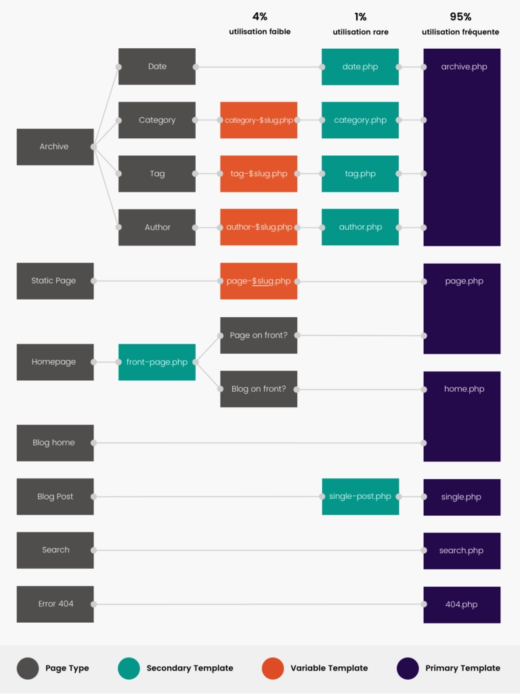

# créer un thème personnalisé WP

## Bases
+ dans wp-content/themes:
    - créer un nouveau dossier avec le nom du thème
    - dans ce fichier créer:
        + index.php :
            ```php
            <?php get_header(); ?>
                <h1>Title</h1>
            <?php get_footer(); ?>
            ```
        + style.css : contient les styles et déclare le thème à WP, c'est dans le bloc de description du début qu'on pourra  indiquer tous les détails du thème (exemple: le text-domain, le nom, la version du thème ou la version php nécessaire), exemple avec le thème twentytwenty:
            ```css
                /*
                Theme Name: Twenty Twenty
                Theme URI: https://wordpress.org/themes/twentytwenty/
                Author: the WordPress team
                Author URI: https://wordpress.org/
                Description: Our default theme for 2020 is designed to take full advantage of the flexibility of the block editor. Organizations and businesses have the ability to create dynamic landing pages with endless layouts using the group and column blocks. The centered content column and fine-tuned typography also makes it perfect for traditional blogs. Complete editor styles give you a good idea of what your content will look like, even before you publish. You can give your site a personal touch by changing the background colors and the accent color in the Customizer. The colors of all elements on your site are automatically calculated based on the colors you pick, ensuring a high, accessible color contrast for your visitors.
                Tags: blog, one-column, custom-background, custom-colors, custom-logo, custom-menu, editor-style, featured-images, footer-widgets, full-width-template, rtl-language-support, sticky-post, theme-options, threaded-comments, translation-ready, block-styles, wide-blocks, accessibility-ready
                Version: 1.3
                Requires at least: 5.0
                Tested up to: 5.4
                Requires PHP: 7.0
                License: GNU General Public License v2 or later
                License URI: http://www.gnu.org/licenses/gpl-2.0.html
                Text Domain: twentytwenty
                This theme, like WordPress, is licensed under the GPL.
                Use it to make something cool, have fun, and share what you've learned with others.
                */
            ``` 
        + functions.php:
            ```php
            <?php

            // Add thumbnail handling
            add_theme_support('post-thumbnails');

            // Automatically add title in site head
            add_theme_support('title-tag');

            // On ne referme pas la balise php quand il n'y a que du php
            ```
        + header.php :
            ```html
            <!DOCTYPE html>
            <html <?php language_attributes(); ?>> <!--Définit la langue du doc automatiquement-->
            <head>
                <meta charset="<?php bloginfo('charset'); ?>"> <!--encodage du site-->
                <meta name="viewport" content="width=device-width, initial-scale=1, shrink-to-fit=no">
                
                <?php wp_head(); ?> <!--pour pouvoir déclarer les scripts et styles-->
            </head>

            <body <?php body_class(); ?>> <!--pour obtenir des noms de classe CSS en fonction de la page visitée ex: single postid-29 ... pour une page article à l'id 29-->
                
            <?php wp_body_open(); ?>  <!--permet à certaines extensions d'écrire du code au début du body (exemple Yoast SEO)-->
            ```
        + footer.php : 
            ```html
                <?php wp_footer(); ?> <!--affiche les scripts de bas de page-->
            </body>
            </html>
            ```
        + screenshot.png : aperçu du thème (image 860 par 660)
        + archive.php
        + front-page.php
        + home.php
        + page.php
        + single.php
+ Activer le thème dans wordpress et supprimer ceux non utilisés
+ On peut ensuite commencer à ajouter du contenu au thème ou modifier les fichiers:

## Divers
Pour les liens ou les sources:
- ``<a href="<?php echo home_url('/'); ?>">`` Un lien vers l'accueil du site
- ``/img/logo.svg" alt="Logo">`` Retrouve le chemin de l'image

## Mise en place
+ vérifier les différentes options dans l'administration du site
+ créer: 
    - catégories,
    - étiquettes, 
    - des pages (puis les attribuer aux pages accueil et blog du site dans lecture si besoin): 
        + accueil
        + contact
        + blog
    - des articles: avec l'extension *fakerpress* par exemple pour créer du faux contenu utile pour tester le rendu


## Template hierarchy


Si WP ne trouve pas un template pour une page il se rabat donc sur index.php
+ Explication d'une branche:
    - modèle: static page => page-$slug.php => page-$id.php => page.php
    - exemple: exemple-page => page-contact.php => page-124.php => page.php
+ pour la page d'accueil WP recherche d'abord front-page.php, s'il ne trouve pas:
    - si une page en accueil => page.php
    - si le blog en acceuil => home.php
+ pour les archives on peut avoir des dérivés (ex: category.php) autrement ce sera category.php


## la boucle wordpress
### Basique:
```php
<?php get_header(); ?>

    //Début boucle
    <?php if( have_posts() ) : while( have_posts() ) : the_post(); ?>

        <h1><?php the_title(); ?></h1>

        <?php the_content(); ?>

	<?php endwhile; endif; ?>
    // fin boucle

<?php get_footer(); ?>   
```
Explications:
- if( have_posts() ) : vérifie qu'il y a bien quelquechose à afficher (contenu page, article, liste d'articles)
- while( have_posts() ) : boucle pour pouvoir afficher du contneu tant qu'il y'en a
- the_post() : prépare les données de l'article pour pouvoir les afficher ensuite
### Boucle pour le blog ou les archives
```php
<?php get_header(); ?>
    <h1>Titre du blog</h1>

    //Début boucle
    <?php if( have_posts() ) : while( have_posts() ) : the_post(); ?>

        <article class="post">
            <h2><?php the_title(); ?></h2>

            <?php the_post_thumbnail(); ?>

            <p class="post__meta">
                Publié le <?php the_time( get_option( 'date_format' ) ); ?> 
                par <?php the_author(); ?> - <?php comments_number(); ?>
            </p>

            <?php the_excerpt(); ?>

            <p>
                <a href="<?php the_permalink(); ?>" class="post__link">Lire la suite</a>
            </p>
        </article>

	<?php endwhile; endif; ?>
    // fin boucle

<?php get_footer(); ?>   
```
### Boucle pour article
```php
<?php get_header(); ?>

  <?php if( have_posts() ) : while( have_posts() ) : the_post(); ?>
    
    <article class="post">
        <?php the_post_thumbnail(); ?>

        <h1><?php the_title(); ?></h1>

        <div class="post__meta">
            <?php echo get_avatar( get_the_author_meta( 'ID' ), 40 ); ?>
            <p>
            Publié le <?php the_date(); ?>
            par <?php the_author(); ?>
            Dans la catégorie <?php the_category(); ?>
            Avec les étiquettes <?php the_tags(); ?>
            </p>
        </div>

        <div class="post__content">
            <?php the_content(); ?>
        </div>
    </article>

  <?php endwhile; endif; ?>

<?php get_footer(); ?>
```

## templates tags:
Ils doivent être utilisés à l'intérieur de la boucle WP
- ``the_title()`` : affiche le titre
- ``the_content()`` : affiche le contenu
- ``the_post_thumbnail()`` : image mise en avant de l'article, renvoie toute la balise ````
- ``the_date()`` : n'affiche qu'une fois la date par date différente (si on a 3 articles le meme jour, seul le premier affiche la date)
- ``the_time( get_option( 'date_format' ) )`` : récupère la date en récupérant, avec get_option( 'format_date' ) la valeur indiquée dans Wp (réglages > général > format de date) 
- ``the_time( 'j F Y à H:i' )`` : récupère la date avec un format de date et heure personnalisé via les paramètres de date PHP (voir cours date PHP) 
- ``the_author()`` : affiche le nom de l'auteur (penser à changer notre nom d'auteur quand on est admin car par défaut c'est l'identifiant de connexion)
- ``the_author_link()`` : affiche le nom de l’auteur avec un lien vers son site personnel
- ``comments_number( 'no response', 'one response', '% responses' )`` : affiche le nombre de commentaires, en paramètre ce qui doit être affiché (ici en anglais) pour "pas de commentaire", "un commentaire", " X commentaires"
- ``the excerpt()`` : affiche l'extrait de l'article, soit :
    + l'extrait rédigé exprès
    + le texte jusqu'au bloc lire la suite dans l'article
    + l'article coupé après 55 mots (non recommandé, coupe n'importe où)
    + Attention: éviter de mettre une balise ``<p>`` autour de l'excerpt dans la boucle, car il peut y en avoir déjà dans l'article, or on ne peut pas mettre plusieurs balises ``<p>`` l'une dans l'autre
- ``the_permalink()`` : renvoie le permalien de l'article (pour un meilleur référencement, les url devraient etre ``titre-publication/%post-name%/`` c'est généralement le cas de base dans les réglages Wp)
- ``get_avatar( get_the_author_meta( 'ID' ), 40 )`` : récupère l'avatar Gravatar de l'auteur (d'habitude les fonctions commençant par ``get_`` permettent uniquement de récupérer le contenu sans l'afficher directement, ici il l'afiche aussi car la fonction ``the_avatar()`` n'existe pas), en paramètres on récupère l'id gravatar de l'auteur , puis on définit la taille de l'image gravatar (ici 40px)
- ``the_category()`` : affiche la catégorie
- ``the_tags()`` : affiche les étiquettes
- ``get_template_directory()`` : récupère le nom du dossier du thème actif (le chemin d'accès)

- Les fonctions en ``get_`` récupère sans afficher en vue d'un traitement  
- Les fonctions en ``the_`` affichent directement la donnée


## Les templates parts
- Pour appeler un **sous-template** : get_template_part('path/part/templatePartName'); il ne faut pas mettre le .php à la fin, 
- on peut s'en servir pour alléger nos templates: ex si notre page de blog et notre page de recherche ont le meme template que les archives on peut juste mettre un ``get_template_part('archive')`` dans ``home.php`` et ``search.php``


## Les conditional tags
+ fonctions de wordpress pour éviter les répétitions de code, on peut ainsi tester des situations, exemple:
    - est-on sur la page d'accueil ?
    - est-ce que l'utilisateur est connecté ?
+ Ils renvoient toujours **vrai** ou **faux**
+ Ils commencent généralement par ``is_`` ou ``has_``
+ exemples de conditionnal tags:
    - ``is_user_logged_in()`` : vérifie si l'utilisateur est connecté
    - ``is_category()`` : vérifie si c'est une page archive de *catégories*
    - ``is_tag()`` : vérifie si c'est une page archive d'*étiquettes*
    - ``is_search()`` : vérifie si c'est une page de résultat de recherche
    - ``is_single()``/``is_single( 12 )``/``is_single( 'slug' )`` : page *single* ou non ?, on peut ajouter l'id de l'article ou son slug en argument, pour vérifier si on est sur tel ou tel article (peu utilisé)
    - ``is_page()``/``is_page( 15 )``/``is_page( 'pagename' )`` : est une *page* ou non ? on peut rajouter des arguments pour tester une page spécifique 
    - ``is_archive()`` : est une archive ou non ?
    - ``is_post_type_archive()`` : est une archive ou non mais dans le cas des Custom Post Types
    - ``is_front_page()`` : est la page d'accueil ? fonctionne que ce soit le blog ou une page standard en page d'accueil
    - ``is_home()`` : est la page blog du site ?
    - ``has_post_thumbnail()`` : l'article possède-t-il une thumbnail ? , utile si on veut afficher des balises autour du thumbnail s'il y en a, car ``the_post_thumbnail()`` génère déjà uniquement s'il y'en a une, donc pas besoin de ``has_post_thumbnail()`` dans le cas ou on ne veut que le thumbnail brut
+ pour débugguer le site, si on souhaite afficher la valeur d'un conditionnal tag, on peut utiliser ``var_dump()`` (généralement placé après le body), à la place de notre site on verra apparaitre le résultat du tag *bool(true)* ou *bool(false)* :
    - ``<?php var_dump( is_front_page() ); die; ?>``

+ Exemple d'utilisation:
    - Dans le cas ou on a utilisé le meme template part pour les archives (catégories, etiquettes,..), la page de recherche et le blog, on peut alors utiliser les conditionnals tags pour afficher des titres différents et dynamique en fonction:
    ```php
    <?php 
        if ( is_category() ) {
            $title = "Catégorie : " . single_tag_title( '', false);
        }
        elseif ( is_tag() ) {
            $title = "Etiquette : " . single_tag_title('', false);
        }
        elseif ( is_search() ) {
            $title = "Résultat de recherche pour :" . get_search_query();
        }
        else {
            $title = 'Le Blog';
        }
    ?>
    <h1><?php $title; ?></h1>
    ```


## templates personnalisés
+ on peut créer un dossier **template**
+ au début de notre template personnalisé on ajoute une ligne de commentaire, bien faire attention à la syntaxe (pas d'espace entre Template Name et ":"):
```php
<?php
/*
    Template Name: Full-width
    Template Post Type: post, page, product
*/
code de la page
```
+ Le commentaire permet à WP de détecter la page comme étant un template
+ la deuxième ligne permet d'autoriser la sélection des templates pour d'autres types de publications (articles, produits, cpt,...)
+ dans l'éditeur de page de WP on peut alors choisir notre template personnalisé dans l'onglet **Attributs de page**


## Fonctions diverses
+ ``single_tag_title( 'prefix', true)`` : affiche l'étiquette ou la catégorie actuellement sélectionnée
    - argument 1: le préfixe à afficher avant le titre exemple si on a la catégorie "chat" on pourrait mettre un préfixe "catégorie"
    - argument 2: booléen: si *true* = afficher le titre, si *false* = uniquement récupérer sans afficher
+ ``get_search_query()`` : récupère l'expression recherchée


## Cutstoms fields
+ menu 3 points en haut à droite > options > cocher **champs personnalisés**
+ fonctionnement basé sur un duo nom(clé)/valeur
+ pour les afficher, on utilise, ou on veut dans la page (même en dehors de la boucle WP): 
    - ``get_post_meta( get_the_ID(), 'nom', true )`` avec en paramètres:
        1. identifiant de l'article
        2. le nom du champs personnalisé
        3. si *true* = valeur du champs est unique pour l'article, si *false* la meta sera un tableau et non une string
+ de base ils ne sont pas très avancés, on utilise généralement ACF du coup

## Fonctionnalités "hors code" des thèmes
- Créer une page d'attente personnalisée avec *Elementor*:
    - on créé une nouvelle page que l'on nomme "attente" , une fois qu'on l'a personnalisé selon nos souhaits on va dans ``elementor>>outils>>maintenance>>arrive bientot>>`` on choisit ensuite le modèle qu'on vient de créer 

- Avec *Elementor* et *OceanWP* on peut créer des footer et header personnalisés, cela permet d'avoir des designs plsu complexes que ceux créés avec le customer (avec la version premium d'*elementor* on peut meme faire cela pour toutes les parties (body, articles, pages,...)) dans ce cas le thème n'est quasi plus utilisé.

- On peut aussi ajouter des règles css personnalisées dans la section "css et JS personnalisé" du customizer:
    - On localise déjà le composant souhaité (en mode inspection par exemple), on lui ajoute une classe un id, ou on retient le code utilisé pour le cibler situé dans la colonne de droite, puis on peux ajouter du css grâce à ces sélecteurs.
